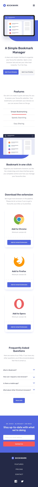

# bookmark-landing-page

# Front-end Style Guide

## Layout

The designs were created to the following widths:

- Mobile: 375px
- Desktop: 1440px

# Screenshots of the designs

# Desktop-active-states

# Desktop-design

# Mobile-active-states

# Mobile-active-nav

  # Mobile-design

# Tab-2-design

# Tab-3-design

## Colors

### Primary

- Soft Blue: hsl(231, 69%, 60%)
- Soft Red: hsl(0, 94%, 66%)

### Neutral

- Grayish Blue: hsl(229, 8%, 60%)
- Very Dark Blue: hsl(229, 31%, 21%)

## Typography

### Body Copy

- Font size: 18px

### Fonts

- Family: [Rubik](https://fonts.google.com/specimen/Rubik)
- Weights: 400, 500

## Icons

For the icons in the design, you can choose between using the icons provided or an font icon library.

Some library suggestions can be found below:

- [Font Awesome](https://fontawesome.com)
- [IcoMoon](https://icomoon.io)
- [Ionicons](https://ionicons.com)
